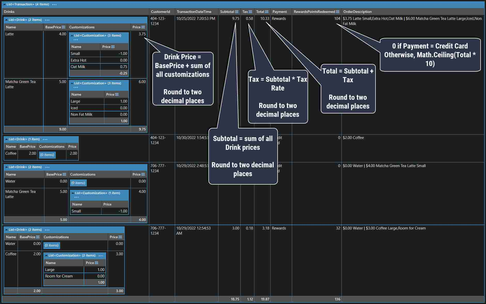
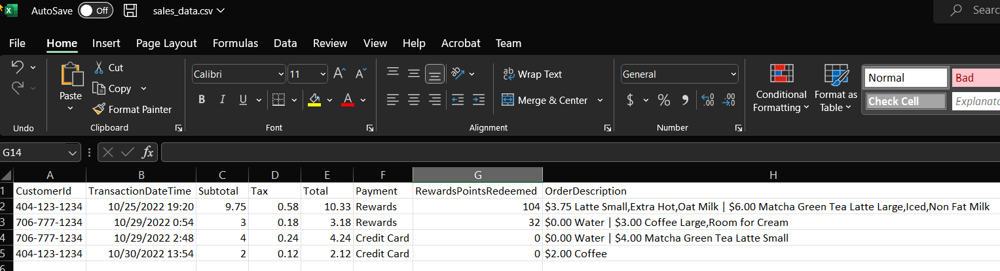

**Coffee Shop Project Fully Operational Implementation**

After a semester of design, now you will code your coffee shop project! You will apply your design efforts to creating an outstanding, friendly, maintainable product that your customer will love (and will not be surprised that it looks completely different from all of the design work so far!).

**1. Requirements (pay very close attention to the first requirement and the last requirement!)**

1. [Build your application using C#, WinForms, and Visual Studio 2022. Use the source project as a basis.](https://github.com/jeff-adkisson/swe_3313_fall_2022/tree/main/Source)
   *Your project will not be accepted if you do not follow this requirement.*
   

2. [Review the Base Project Usage document carefully and studio the code.](https://github.com/jeff-adkisson/swe_3313_fall_2022/tree/main/Documentation/0_GettingStarted)

   

3. [Implement all screens described in the Project Introduction. ]()Your screens should look as close as possible to your UI design (you will be comparing what you built to what you designed in your presentation). You will have at least 6 (or 7, if customer creation is a separate screen) fully operational screens.

   

4. Create working versions of the[ screens and flows described in the UI project.]() As much as possible, try to match your UI design.
   \- Main
   \- Customer List and Add Customer Screen
    \+ All fields are required when adding a customer. Do not allow bad data.
    \+ You cannot create duplicate customer records for the same phone number. Verify phone numbers are unique.
   \- Order Drink Screen
    \+ Customer can order 1 or more drinks.
    \+ Each drink can have 0 or more customizations.
    \+ You cannot proceed to payment if there are 0 drinks.
   \- Payment Screen
    \+ If anonymous, only accept credit card payment.
    \+ If not anonymous, allow credit card payment or (rewards points *if* the customer has enough rewards points to pay the entire order).
    \+ If credit card payment, validate the credit card number using the open source [CreditCardValidator NuGet package.](https://github.com/gustavofrizzo/CreditCardValidator)
   \- Receipt Screen
   \- Management Screen

   

5. Read and write customer data to the Customers.json file using the Services/Customer/CustomerService.cs customer management service from the base project (you must extend it).

   

6. Read all drink data including customizations from the Services/DrinkMenu/DrinkMenuService.cs. Use the DrinkMenu.json file in the JsonStorage folder. [HINT: See the MVC Coffee demo...](https://github.com/jeff-adkisson/swe_3313_fall_2022/tree/main/LectureDemos/Mvc_Coffee/Services)

   

7. Write CSV data of all customer sales data stored in Customers.json from the Management screen using the open source [CsvHelper NuGet package](https://joshclose.github.io/CsvHelper/getting-started/). CSV details are listed below. [HINT: See the MVC Coffee demo...](https://github.com/jeff-adkisson/swe_3313_fall_2022/tree/main/LectureDemos/Mvc_Coffee/Services)

   Your CSV file should have these columns:
   \- CustomerId
   \- TransactionDateTime
   \- Subtotal
     \> Sum of drink cost in order, round to two decimal places
   \- Tax
     \> Subtotal * TaxRate, round to two decimal places
   \- Total
     \> Subtotal + Tax, round to two decimal places
   \- Payment
     \> Credit Card *or* Rewards
   \- RewardsPointsRedeemed
     \> If Credit Card, 0
     \> Otherwise, Math.Ceiling(Total * 10)
   \- OrderDescription
     \> Combine all drinks and customizations for order into a single line
     \> Put total price of drink (drink plus cost of customizations) first formatted as currency with 2 decimal points
     \> Separate each customization with a , character
     \> Separate each drink with a | character
     \> For example, here's an order with two drinks, each with customizations: $3.75 Latte Small,Extra Hot,Oat Milk | $6.00 Matcha Green Tea Latte Large,Iced,Non Fat Milk

   Here is an example CSV file for four orders:

   CustomerId,TransactionDateTime,Subtotal,Tax,Total,Payment,RewardsPointsRedeemed,OrderDescription
   404-123-1234,10/25/2022 19:20:53,9.75,0.58,10.33,Rewards,104,"$3.75 Latte Small,Extra Hot,Oat Milk | $6.00 Matcha Green Tea Latte Large,Iced,Non Fat Milk"
   706-777-1234,10/29/2022 00:54:53,3.00,0.18,3.18,Rewards,32,"$0.00 Water | $3.00 Coffee Large,Room for Cream"
   706-777-1234,10/29/2022 02:48:53,4.00,0.24,4.24,Credit Card,0,$0.00 Water | $4.00 Matcha Green Tea Latte Small
   404-123-1234,10/30/2022 13:54:53,2.00,0.12,2.12,Credit Card,0,$2.00 Coffee 

   [There is a Linqpad demo here that might give you some insight.](https://github.com/jeff-adkisson/swe_3313_fall_2022/tree/main/LectureDemos/CSV_Demo_Linqpad)

   

8. Submit your C#/WinForms source code via your team's GitHub repo. [Your code *must* compile and execute by calling **dotnet run** after I pull it from GitHub](https://learn.microsoft.com/en-us/dotnet/core/tools/dotnet-run). If there are *any* specific instructions how to run your project aside from going to the **Source/CoffeePointOfSale** directory that contains **CoffeePointOfSale.cspro**j and typing **dotnet run**, include detailed step-by-step execution instructions in a **readme.md** file in the same folder as your **CoffeePointOfSale.csproj** file. Note that including execution instructions is always good practice, even if it is completely obvious to you. It might not be obvious to everyone or even you in a few years.

   IMPORTANT! *SWE/CS students have so much trouble with this!* If your code does not compile, I cannot grade it. This is not a freshman class, so I also will not attempt to fix compilation problems for you. So do something like this to be 100% sure you got this right:
   8A) Have every student in your team clone your code from GitHub to a fresh directory (in other words, somewhere new on your machine).
   8B) Every student should open a terminal, go to the directory containing the project's csproj file, then type **dotnet run**. If it doesn't work, figure out why!

**2. Implement your project using your team's UI design**

Your coding effort should follow your UI design as much as possible. During your project presentation, you will compare your actual implementation to your UI design. You will recall the following from the [UI design project]():

> *Do not forget you are ultimately building a WinForms application - not a website or phone app. That means things must fit in the app window (you are not working in a browser). Do not show things in your prototype you cannot accomplish in a WinForms application. **If your team has split coding and design responsibilities, be certain your designer and your coder agree what you are designing can be built. Your prototype must be achievable in code - what you are prototyping here will be compared to your final project during your end-of-semester presentation.** Your WinForms application will have a screen size of 1348x721, so your prototype's proportions should approximate that (within the limits of PowerPoint or Marvel). Make sure your entire team agrees that your design can be built. Your customer is going to expect the final application to look much like your prototype.*

**3. Minimum Effort to get a C on \*this\* project**

If your team is having trouble delivering everything, here is the minimum passing submission requirement. Choose some or all of these to decrease your effort. Each of following is worth 7.5% off your grade (4 * 7.5% = 70%).
\- Do not write Customer sales data and rewards points to Customers.json - just accept orders. Assume all non-anonymous customers have infinite rewards points. Drink menu data can be hardcoded instead of reading from DrinkMenu.json and the DrinkMenu service.
\- Do not validate the Credit Card.
\- Do not verify the Customer's phone number is unique.
\- Do not implement the CSV extract.

TLDR: To get a C on this part, your application *must compile* and enable me to go through all flows except the CSV extract, but all flows do not require data storage and input validation.

**4. Follow the professional coding standards and good design methodologies we have discussed all semester

**4A) Use the design documentation you produced during the Technical Design phase to build your classes, data storage, etc.
4B) [Strive for low cyclomatic complexity and keep your methods under 30 lines each.](https://medium.com/@brooknovak/reducing-cyclomatic-complexity-in-your-code-bb132d1665a2)
4C) [Avoid creating do-it-all "god" classes by trying to remember the Single Responsibility Principle](https://medium.com/@carlos.ariel.mamani/the-god-object-or-god-class-anti-pattern-bfb8c15eb513).
4D) [Use C# naming conventions - not Java, Python, etc.](https://learn.microsoft.com/en-us/dotnet/csharp/fundamentals/coding-style/coding-conventions) Every language has conventions for how to best name things and they are not all the same.
4E) [Comment your code where appropriate.](https://blog.submain.com/c-comments-complete-guide/)

Assume that sooner later someone interviewing you for a job is going to want a code example. If you do a great job on this project, you will have something that might help you get a job. Don't just think of this as another grade - consider it a piece of your future portfolio that might help get you a job after graduation.

**5. Submission Requirements

**Commit your team's fully operational project to your /Source directory in your shared team repo.

When I grade your submission, I will download your repo, switch to the /Source/CoffeePointOfSale directory and type **dotnet run**. Therefore, your submission must have CoffeePointOfSale.csproj in that directory.

If your project fails to compile, I will not attempt to fix it and I will not be able to grade it. As working professionals, submitting working code is essential. Verify your submission *carefully*.

**GRADING RUBRIC**

10% - Code compiles and runs without intervention, or effort outside of pulling from your team repo and [typing **dotnet run** in the same folder as your .csproj file](https://learn.microsoft.com/en-us/dotnet/core/tools/dotnet-run). **You will either get all 10% of this \*or a zero on the entire project\*. Ensure your project compiles!**

7.5% - Write customer data and rewards points to Customers.json. Drink menu data is not hardcoded and is loaded from DrinkMenu.json via the DrinkMenu service.

7.5% - Validate the Credit Card using the open source [CreditCardValidator NuGet package.](https://github.com/gustavofrizzo/CreditCardValidator)

7.5% - Verify the Customer's phone number is unique when adding.

7.5% - CSV extract pulls from Customers.json file and contains correct information using the open source [CsvHelper NuGet package](https://joshclose.github.io/CsvHelper/getting-started/).

10% - Main screen meets all requirements.

15% - Customer management screen (list and add) meets all requirements.

15% - Order Drink screen meets all requirements.

10% - Payment screen meets all requirements.

10% - Receipt screen meets all requirements.

**HOW DRINK ORDER HISTORY MAPS TO CSV EXTRACT**

[This image was generated from this Linqpad script...](https://github.com/jeff-adkisson/swe_3313_fall_2022/tree/main/LectureDemos/CSV_Demo_Linqpad)

**CSV EXTRACT EXAMPLE IN EXCEL**

Here is what an example CSV extract looks like when saved to sales_data.csv, then opened Excel:

CustomerId,TransactionDateTime,Subtotal,Tax,Total,Payment,RewardsPointsRedeemed,OrderDescription
404-123-1234,10/25/2022 19:20:53,9.75,0.58,10.33,Rewards,104,"$3.75 Latte Small,Extra Hot,Oat Milk | $6.00 Matcha Green Tea Latte Large,Iced,Non Fat Milk"
706-777-1234,10/29/2022 00:54:53,3.00,0.18,3.18,Rewards,32,"$0.00 Water | $3.00 Coffee Large,Room for Cream"
706-777-1234,10/29/2022 02:48:53,4.00,0.24,4.24,Credit Card,0,$0.00 Water | $4.00 Matcha Green Tea Latte Small
404-123-1234,10/30/2022 13:54:53,2.00,0.12,2.12,Credit Card,0,$2.00 Coffee 

