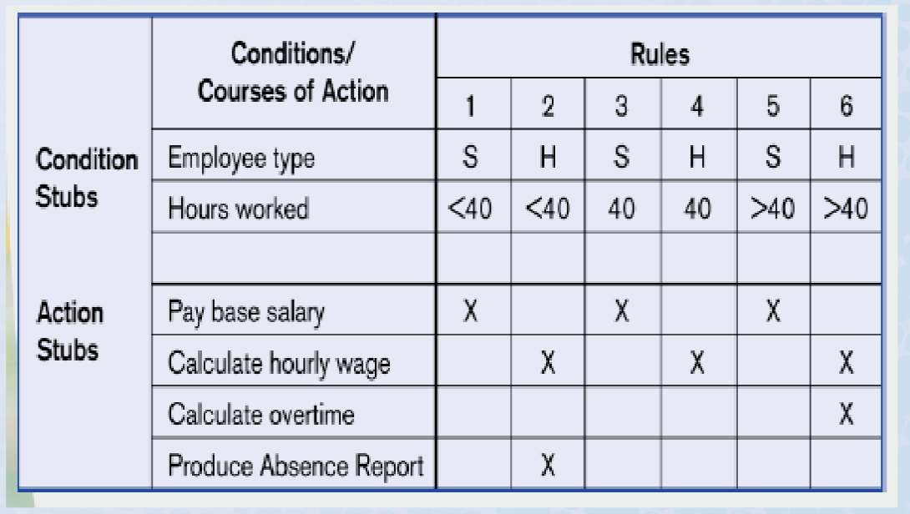

# Decision Table Converted to C# project Code Demo

This project is convered from Linqpad to a C# .csproj console application from here: https://github.com/jeff-adkisson/swe_3313_fall_2022/tree/main/LectureDemos/DecisionTable_Linqpad

The code uses the ObjectDumper open source nuget package to write the object structures to the 
console instead of linqpad's `.Dump` command. https://github.com/thomasgalliker/ObjectDumper 

## To run from CLI:
1. `git clone https://github.com/jeff-adkisson/swe_3313_fall_2022.git`
2. Open a terminal.
3. Change the directory to `swe_3313_fall_2022\LectureDemos\DecisionTable_VisualStudio`
4. Type `dotnet run`.

## To run in Visual Studio
1. Open `DecisionTable_VisualStudio.csproj` in Visual Studio.

# Diagram
This code demonstrate the code derived from the following decision table
we covered in lecture:

