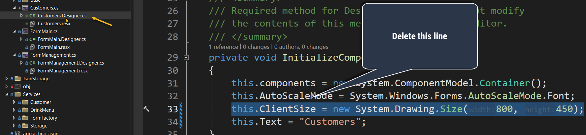

# Base Project Usage

## Fork This Project

Each team needs to fork this project.

Every project submission will be checked into your forked repo, including documentation, code, etc.

Get used to cloning, merging, and pushing changes. Here's a good getting started video: https://www.youtube.com/watch?v=mVnZVw4KJnc

To understand forking, take a look at this: https://docs.github.com/en/get-started/quickstart/fork-a-repo

IMPORTANT: Each team will have a Github repo that the team will share. Anytime you submit your work, you will put the repo's link in the D2L assignment submission. I will not accept zip files or other documents via D2L. You must submit your work via Github.

## How to Add a Form

Your `FormMain` is already configured, aside from adding whatever graphics, logic, navigation, etc. the requirements demand. Use this form to launch the customer list, add order, and management tools.

Carefully review `FormManagement`. It demonstrates many of the instructions in the rest of this section.

To properly add a new form to the base project:

1. Add a new Form in Visual Studio 2022, then view the code.
   

1. Modify the constructor to inherit from `Base.BaseFormNoClose`. This will ensure your form is automatically registered with the Dependency Injection container. For example, if you have a new form named *Customers*, change it to:
   `public partial class Customers : Base.FormNoCloseBase`

1. Open the `InitializeComponent()` method in your form's `.designer.cs` file. This is called from the constructor of your new form.  *Remove* the following line to make sure your form is the correct size (the `Base.BaseFormNoClose` class will set the size for you):
   `this.ClientSize = new System.Drawing.Size(800, 450);`

   

   After making this change, save all changes, close the form and re-open it. Look at the form's `Size` property from the designer to verify it is now `1366,768`. If you do not see that, review the prior steps carefully. All of your forms will be this size.
    

1. Add a constructor of to your new form to receive the application's settings (and any other dependencies in the Services folder). Do not add parameters to the original constructor (you will get an error in the WinForms VS designer). For example:

   ```c#
   private IAppSettings? _appSettings;
   public Customers(IAppSettings appSettings) : this()
   {
       _appSettings = appSettings;
   }
   ```

   After adding this constructor, your new form will automatically receive the application's configuration settings (such as Tax Rate) in the `_appSettings` field. Remember to use the configuration to avoid hardcoding important values that might change such as Tax Rate and Reward Points Per Dollar.
   

1. Add any logic you want to execute when the form loads to the `Load` event. Open the events list for the form and double-click on the empty space next to `Load` to have Visual Studio create the event for you. Then add your logic to the event method. For example, this is in `FormManagement` to load the customer list:

   ```c#
   private void OnLoadFormManagement(object sender, EventArgs e)
   {
       DemonstrateGettingCustomerList();
   }
   ```

1. To close a form that is *not* `FormMain`, call the `this.Close()` method. To return to `FormMain`, call `FormFactory.Get<FormMain>().Show();` after calling `Close()`. 
   When using `FormMain`, call `this.Hide()` before showing another form. Calling `Close` from `FormMain` will exit your application.

1. To test your new form, add a button to *another* form such as `FormMain` and open the new form like this from the button's `Click` event:
   ```FormFactory.Get<NewFormClassNameHere>().Show();```
   **If this call fails**, your new form does not inhert from the `Base.BaseFormNoClose` base form.

1. After opening your new form, you will note you cannot close it. The  `Base.BaseFormNoClose` form disables that functionality. Add a button that returns to `FormMain` like I demonstrated in `FormManagement`:
   


## Registering services

The base project uses the Microsoft dependency injection (DI) framework to help you decouple your code using the Inversion of Control (IoC) pattern. This is one of the methods we discussed to help reduce coupling in our code.

The ```Startup``` class in `Program.cs` contains the registration methods you need when you need a new service available to the DI container.

To create additional services, register them in ```Startup.ConfigureDependencies```:

```c#
private static void ConfigureDependencies(IServiceCollection services)
    {
	    services.AddSingleton<IStorageService, StorageService>();
        services.AddSingleton<ICustomerService, CustomerService>();
        services.AddSingleton<IDrinkMenuService, DrinkMenuService>();
        //add your dependencies here

        RegisterForms(services);
        services.AddLogging(configure => configure.AddConsole());
    }
```

You will note that `CustomerService` and `DrinkMenuService` are already present... you need to finish them by adding the appropriate logic.

Review `FormManagement` for a demo of the basic `CustomerService` logic that reads customers from a JSON file. You will note it is injected in the constructor and placed into a private field so it is available to the class's methods:

You can only request `ICustomerService` this way because it was registered via the project's dependency injection configuration in `Program.cs`.

## Configuration

The base project already has a JSON configuration file called `appsettings.json`. You will note that the structure of this file matches the classes in the ```Configuration``` namespace. ```Configuration.AppSettings``` is the root of the configuration class structure.

To add additional configuration properties, add them to ```Configuration.AppSettings``` and the actual configuration data to `appsettings.json`. Review the JSON lecture if you are unfamiliar with the JSON format. You will recall that loading a JSON file into a class structure is called *deserialization* (or rehydrating).

## Dependencies

The base project already references the ```Newtonsoft.Json``` Nuget package. There are many JSON parsers available in the .NET ecosystem. I chose Newtonsoft for this project because it is popular, friendly, flexible, and well documented. In practice, Newtonsoft is being replaced
by Microsoft's faster ```System.Test.Json``` parser, but I avoided it because it is a bit more complex in certain cases.

The ```StorageService``` is provided for you and uses the JSON parser which will help you complete the JSON read/write requirement. You will need to implement the appropriate classes it uses in the Services for Customer and DrinkMenu.

You also need to reference these Nuget packages. Google how to do that if you need help:

*  CsvHelper - https://joshclose.github.io/CsvHelper/
*  CreditCardValidator - https://github.com/gustavofrizzo/CreditCardValidator

## Storage

The ```StorageService``` reads and writes JSON files from/to the `bin\Debug\net6.0\JsonStorage` directory.

When you compile your application, it copies everything in the application's ```JsonStorage``` directory to the ```bin``` directory. Your DrinkMenu.json file will go in the application's ```JsonStorage``` directory where it will be copied into the ```bin``` directory for your application to load on start.

To create your ```DrinkMenuService```, review how the ```CustomerService``` is implemented. It will follow the same pattern.

When you add your Menu.json file to ```JsonStorage```, be sure to set its ```Copy to Output Directory``` property to ```Copy if newer```. If you omit this step, the compiler *will not* copy the JSON file to the ```bin``` directory.


## Numeric Data

You will note in the ```AppSettings.Tax``` class that the tax rate is stored as a decimal data type.

The decimal type is used for financial data (or any data where floating point precision is critical). You will store all data related to financial transactions using decimal. Do not use double or float for financial data.

For more information, read these links:
https://stackoverflow.com/questions/803225/when-should-i-use-double-instead-of-decimal
https://exceptionnotfound.net/decimal-vs-double-and-other-tips-about-number-types-in-net/


